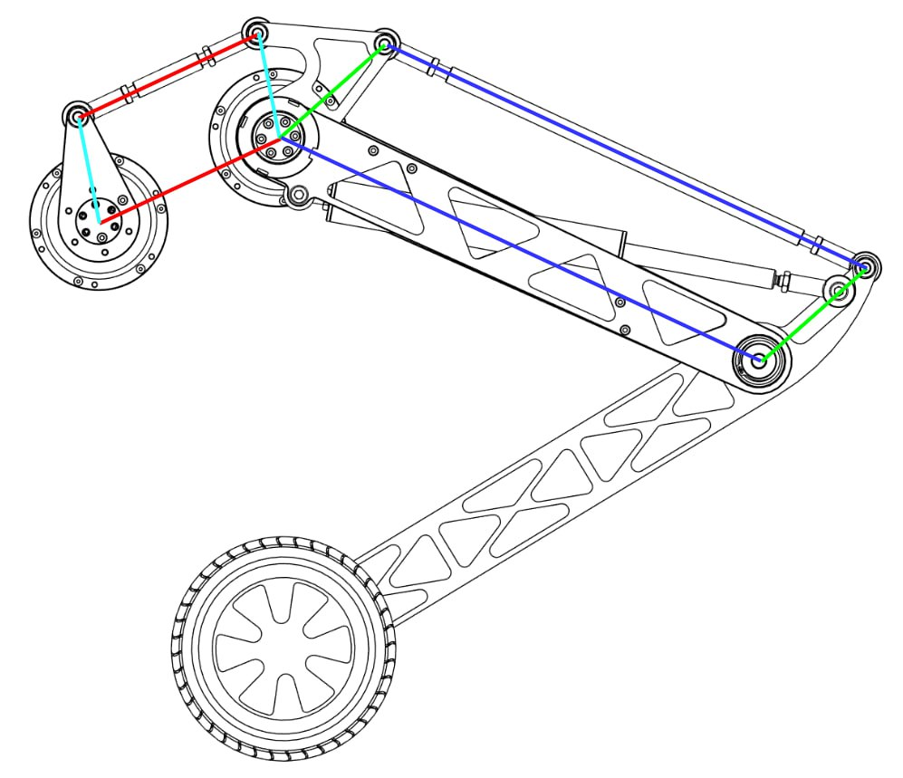
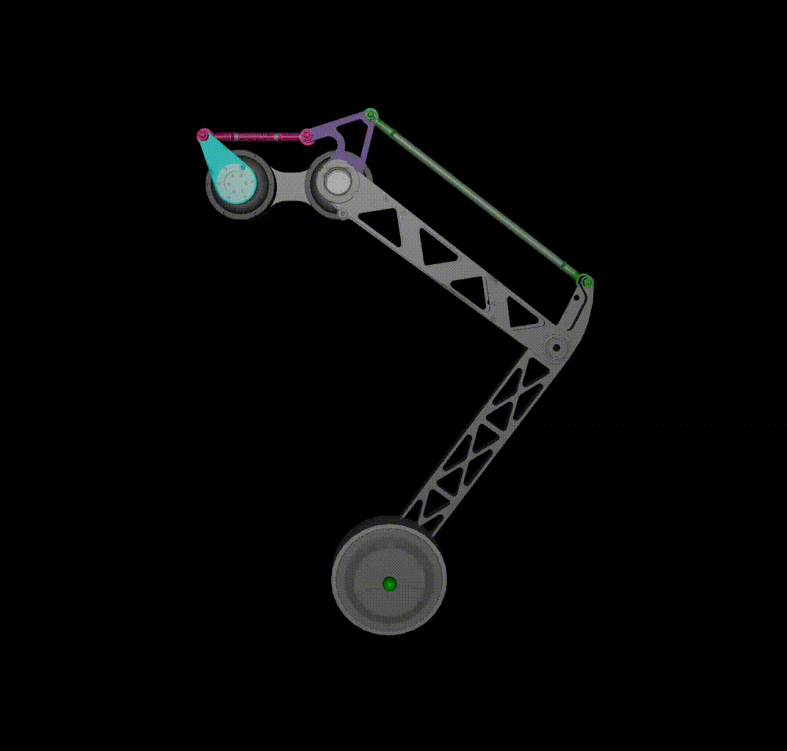

# Biped Wheeled Leg

A minimal project for modeling and controlling a **two-link biped leg with a wheel** at the ankle.  
The model is built using **[Pinocchio](https://github.com/stack-of-tasks/pinocchio)** for kinematic computations, and **MuJoCo** can be used for visualization or simulation.  
Inverse kinematics (IK) are solved analytically using trigonometric equations for efficiency and compatibility with low-power hardware such as the Raspberry Pi.


Mean frequency to calculate IK: 3885.87 Hz



---

## Project Structure

```

biped_wheeled_leg/
├── meshes/                     # STL/OBJ meshes for the URDF model
│   ├── biped_wheeled_leg_open.urdf
│   ├── biped_wheeled_leg_open.xml
│   └── biped_wheeled_leg.xml
├── cad_models/                 # Optional CAD sources
│   ├── urdf_leg_model.step
│   └── urdf_model.SLDASM
├── biped_wheeled_leg.py        # Main Python class (BipedWheeledLeg)
├── example.py                  # Example usage / simulation
├── requirements.txt            # Core dependencies
├── requirements_example.txt    # Additional dependencies for examples
├── README.md                   # This file
└── TODO.md

````

---

## Installation

### 1. Clone the repository
```bash
git clone https://github.com/yourusername/biped_wheeled_leg.git
cd biped_wheeled_leg
````

### 2. Create and activate a virtual environment

It’s recommended to use Python ≥ 3.9.

```bash
python3 -m venv env
source env/bin/activate        # On Windows: env\Scripts\activate
```

### 3. Install dependencies

#### Core environment

Contains everything needed to load the model, run kinematics, and compute IK:

```bash
pip install -r requirements.txt
```

#### Example environment

If you want to run the visualization or simulation examples (e.g. `example.py`):

```bash
pip install -r requirements_example.txt
```

> 💡 The “example” requirements include MuJoCo and viewer libraries, which are optional if you only need Pinocchio-based computations.

---

## Description

* **Model parsing:** The URDF model (`biped_wheeled_leg_open.urdf`) is loaded using **Pinocchio**.
* **Kinematics:** Link transformations and Jacobians are computed using Pinocchio’s efficient routines.
* **Inverse Kinematics:** Solved analytically with trigonometric equations (no optimization or numeric solvers needed).
* **Jacobian:** The Jacobian is derived symbolically for the 2-link planar case.
* **Performance:** Designed to run even on a **Raspberry Pi**, where analytical IK is preferable for speed and numerical stability.

---

## Running an Example

Once installed, you can launch a simple demonstration:

```bash
python example.py
```



The example will:

* Load the biped wheeled leg model.
* Compute inverse kinematics for random target points.
* Optionally visualize the motion in a MuJoCo viewer (if installed).

---

## Notes

* If you are running on a Raspberry Pi, disable MuJoCo visualization to save resources — the analytical kinematics will still run perfectly fine.
* The class `BipedWheeledLeg` in `biped_wheeled_leg.py` exposes:

  * `ik_solve(x, y)` – analytic inverse kinematics
  * `jacobian(hip_motor, knee_motor)` – motor-space Jacobian
  * Link lengths and joint offsets are automatically extracted from the URDF.

---

## Dependencies

| Library             | Purpose                                    |
| ------------------- | ------------------------------------------ |
| `pinocchio`         | Kinematics, frame transforms, URDF parsing |
| `numpy`             | Math utilities and matrix operations       |
| `mujoco` (optional) | Visualization and simulation (examples)    |
